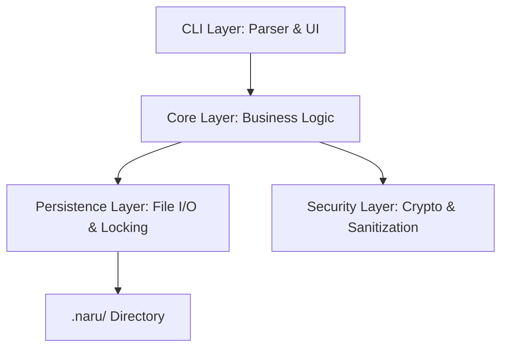

# 🏗️ Naru Architecture

Naru is built with a modular, **Domain-Driven Design (DDD)** inspired architecture. It prioritizes the separation of concerns between data models, business logic, and persistence layers.

## 🧱 Layered Overview



### 1. CLI Layer (`src/cli/`)
- **Parser**: Uses `clap` to handle command-line arguments and subcommands.
- **Interactive**: Provides terminal UI elements via `dialoguer` for a better user experience during schema editing.

### 2. Core Domain (`src/core/`)
- **Models**: Defines the data structures for `ConfigFile`, `SchemaFile`, and `AuditLogEntry`.
- **Validation**: Pure functional logic to validate data against schema rules.
- **Audit**: Logic for generating hash-chained log entries.

### 3. Security & Crypto (`src/core/crypto.rs` & `security.rs`)
- **Encryption**: Wraps `aes-gcm` to provide high-level encrypt/decrypt primitives.
- **Sanitization**: Critical logic to prevent **Directory Traversal** and **Injection** attacks.
- **KDF**: SHA-256 based Key Derivation Function.

### 4. Persistence (`src/core/persistence.rs`)
- **JSON Storage**: Handles serialization/deserialization of project state.
- **File Locking**: Uses OS-level advisory locks via `fs2` to prevent data corruption during concurrent writes.
- **Atomic Writes**: Ensures that configuration updates are atomic and thread-safe.

## 📁 Project Structure

```text
src/
├── main.rs          # Application Entry Point & Command Dispatcher
├── cli/             # CLI Parser & Subcommand Definitions
└── core/            # Domain Logic (The "Brain" of Naru)
    ├── audit.rs     # Hash-chained logging system
    ├── crypto.rs    # Encryption primitives (AES-256-GCM)
    ├── persistence.rs # File handling & Import/Export logic
    ├── schema.rs    # Schema management logic
    └── security.rs  # Input sanitization & Path safety
```

## 🔄 Lifecycle of a Command
1. **Parse**: `clap` parses the arguments.
2. **Lock**: `persistence` acquires an exclusive lock on `.naru/config.json`.
3. **Load**: The current state is loaded into memory.
4. **Logic**: The domain logic (e.g., `set`, `validate`) is applied.
5. **Log**: An `AuditLogEntry` is generated and chained to the previous entry's hash.
6. **Save**: The new state is written back to disk.
7. **Unlock**: The file lock is released.